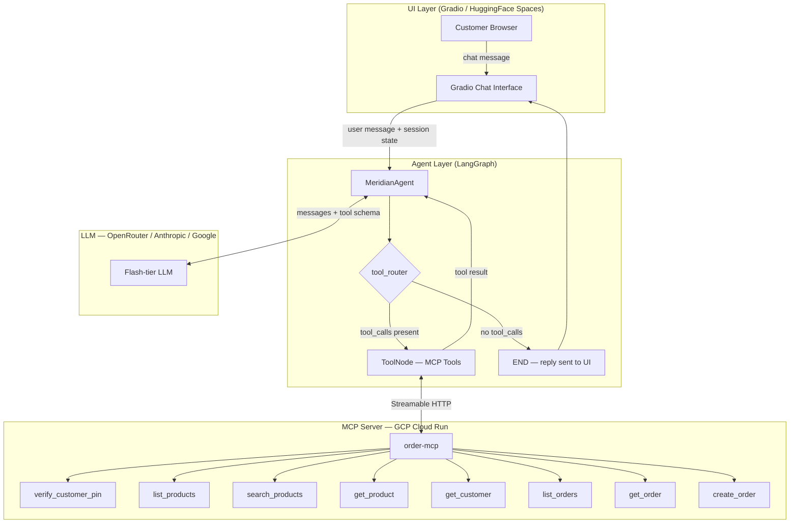
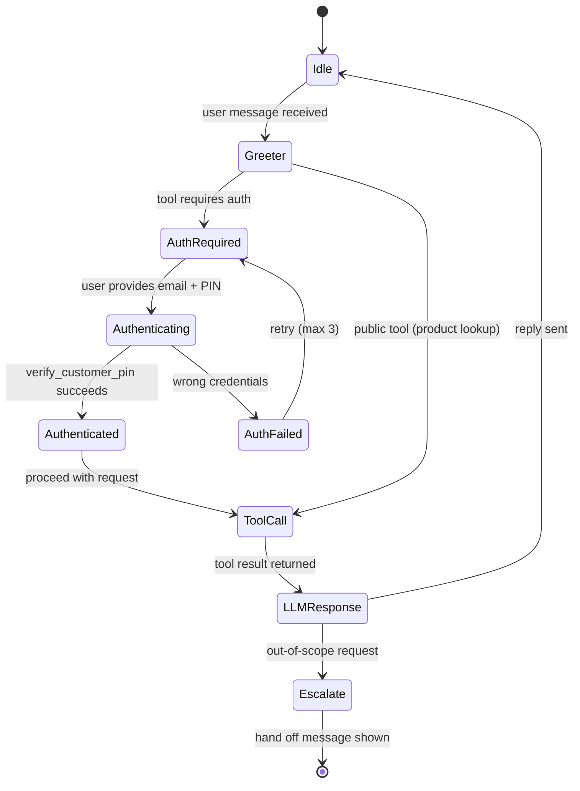

# Meridian Electronics — Customer Support Chatbot: Build Plan

## Overview

A LangGraph-powered customer support chatbot for Meridian Electronics, connecting to an MCP server over Streamable HTTP. Built with Gradio, deployed to HuggingFace Spaces. Uses OpenRouter as the default LLM provider (swappable to Anthropic or Google via env var).

---

## Architecture Diagram



---

## State Machine



---

## File Structure

```text
andela_technical_assessment/
├── agent/
│   ├── __init__.py
│   ├── state.py          # AgentState TypedDict + initial_state()
│   ├── graph.py          # MeridianAgent class + _build_llm() factory
│   ├── nodes.py          # build_worker_node() factory + tool_router()
│   ├── mcp_client.py     # make_client() + load_tools() — Streamable HTTP
│   └── prompts.py        # SYSTEM_PROMPT (Meridian-specific)
├── app.py                # Gradio UI entry point
├── test_mcp_tools.py     # MCP tool test suite — 46 tests, two modes
├── pyproject.toml        # uv project + dependencies
├── uv.lock               # pinned dependency tree
├── .env.example          # env var template (no secrets)
├── .gitignore
├── README.md
└── BUILD_PLAN.md
```

---

## Phase Plan

### Phase 1 — Core Agent (0–60 min)

**Goal:** Working agent that can call MCP tools from the terminal.

| Task | File | Notes |
| --- | --- | --- |
| Discover MCP tools via `langchain-mcp-adapters` | `mcp_client.py` | `MultiServerMCPClient` with `streamable_http` transport |
| Define `AgentState` | `state.py` | `messages`, `authenticated`, `customer_email`, `session_token`, `auth_attempts` (MCP `customer_id` UUID lives in tool results / conversation, not a dedicated graph field today) |
| Wire LangGraph graph | `graph.py` | START → worker → tool_router → tool_node → worker → END |
| Write system prompt | `prompts.py` | Role, scope, auth requirement, escalation rule |
| Test tool calls in REPL | — | Confirm `verify_customer_pin` + order lookup flows |

**Cut:** Evaluator node (single worker loop is sufficient), `auth_guard` as a separate node (auth handled via system prompt instead).

---

### Phase 2 — Gradio UI + Ship (60–120 min)

**Goal:** Live chat interface deployed to HuggingFace Spaces.

| Task | File | Notes |
| --- | --- | --- |
| Build Gradio `gr.Blocks` UI | `app.py` | Chat history, session state via `gr.State` |
| Auth flow via system prompt | `prompts.py` | LLM asks for credentials, calls `verify_customer_pin` |
| Error handling | `nodes.py` | MCP timeout, bad tool result, LLM refusal |
| MCP tool test suite | `test_mcp_tools.py` | 46 pass/fail tests + `--demo` narrative mode |
| `pyproject.toml` + `.env.example` | root | `uv` project, pin versions, no secrets in example |
| README | `README.md` | Overview, architecture, setup, run, test |
| Push to GitHub | — | Clean repo, no secrets |
| Deploy to HuggingFace Spaces | — | Set env vars as Space secrets |

---

### Phase 3 — Polish (120–180 min, cut if needed)

| Task | Notes |
| --- | --- |
| Retry logic on MCP timeout | 3 retries with exponential backoff |
| Auth attempt counter as code | Currently handled by system prompt; could be enforced in state |
| Graceful escalation message | Already in system prompt |
| Next.js UI (bonus) | Only if Phases 1–2 are solid |
| Vercel deployment (bonus) | FastAPI backend + Next.js frontend |

---

## Key Technical Decisions

| Decision | Rationale |
| --- | --- |
| **LangGraph over raw tool-calling** | Explicit graph = testable state machine; conditional routing is a single function |
| **MCP Streamable HTTP** | Matches server transport; avoids stdio complexity |
| **OpenRouter as default provider** | Single API key gives access to cost-effective models (gpt-4o-mini, Haiku, Flash) — swappable without code changes |
| **Auth via system prompt, not a graph node** | Simpler; the LLM is better at natural-language auth dialogue than hard-coded state transitions |
| **Session auth in state** | `AgentState` reserves `authenticated`, `customer_email`, `session_token` for future enforcement; today auth is driven by the system prompt + tool results in `messages` (same `thread_id` = same LangGraph checkpoint) |
| **`make_client()` not a context manager** | `langchain-mcp-adapters` v0.1+ removed context manager support; client manages its own lifecycle |
| **Gradio first, Next.js bonus** | Fastest path to shareable demo URL |
| **HuggingFace Spaces** | Free tier, public URL, dead-simple deploy from GitHub |
| **Two test modes** | Adapter path (46 pass/fail tests) validates chatbot code; raw JSON-RPC demo validates the server protocol independently |

---

## MCP Tool Mapping to User Flows

| Customer Request | MCP Tool(s) | Auth Required |
| --- | --- | --- |
| "Is the MX500 keyboard in stock?" | `search_products`, `get_product` | No |
| "What keyboards do you have?" / product type in natural language | `search_products` (e.g. query `keyboard`) — not `list_products(category="Keyboards")` if that category is not a server label | No |
| "Show me all monitors" | `list_products` (category=Monitors) when that label exists; else `search_products` | No |
| "What are my recent orders?" | `verify_customer_pin` → `list_orders` | Yes |
| "I want to place an order" | `verify_customer_pin` → `get_product` (per SKU for live `unit_price`) → `create_order` | Yes |
| "Show me order details" | `verify_customer_pin` → `get_order` (with `order_id` from user or from `list_orders`) | Yes |
| "My last order" / no `order_id` | `verify_customer_pin` → `list_orders` → optionally `get_order` on chosen row | Yes |
| Filtered orders ("pending", "shipped") | After verify: `list_orders` with `status` mapped to server enum (see `prompts.py`) | Yes |
| User pastes only an `order_id` UUID | `get_order` first; on error, `verify_customer_pin` then retry if needed | Case-by-case |
| SKU-only question ("price for MON-0054") | `get_product` | No |
| Cancel / refund / change address | No tool — escalation copy | — |

---

## Auth Flow Detail

```text
User: "Show me my orders"
Bot:  "To access your account, please provide your email and PIN."
User: "donaldgarcia@example.net / 7912"
Bot:  [calls verify_customer_pin(email, pin)]
      → success → customer_id extracted from response
      [calls list_orders(customer_id=...)]
      → returns 14 orders → formats response
```

Failed auth: retry prompt (max 3 attempts), then escalate to support team.

---

## LLM tool-use contract (MCP manifest)

The system prompt in `prompts.py` must name **only** tools exposed by the server. Parameter summary:

| Tool | Required args | Optional args |
| --- | --- | --- |
| `list_products` | — | `category` (exact server taxonomy only), `is_active` — if filtered result is empty, fall back to `search_products` before claiming no stock |
| `search_products` | `query` | — |
| `get_product` | `sku` | — |
| `verify_customer_pin` | `email`, `pin` (4-digit string) | — |
| `get_customer` | `customer_id` (UUID) | — |
| `list_orders` | — | `customer_id`, `status` (draft, submitted, approved, fulfilled, cancelled) |
| `get_order` | `order_id` (UUID) | — |
| `create_order` | `customer_id`, `items` | items: `{ sku, quantity>0, unit_price string, currency? }` — fetch `unit_price` via `get_product` before ordering (matches `test_mcp_tools.py`) |

### Prompt behavioral guarantees (see `prompts.py`)

| Topic | Behavior |
| --- | --- |
| Catalogue / order summaries | SKUs, prices, stock, UUIDs copied verbatim from tool text — no rounding |
| `get_customer` | Read-only; profile/address **changes** escalate to support |
| No MCP coverage | Cancellations, refunds, payments, repairs — escalate; do not imply completion |
| Auth | Track failed PIN attempts in-conversation (max 3); new identity → verify again |
| `create_order` | Clarify ambiguous quantity/SKU before calling; use live `get_product` prices |

---

## What Was Cut

| Item | Reason |
| --- | --- |
| Evaluator / self-critique node | Single LLM pass is fast enough; adds latency and cost for little gain in this scope |
| `auth_guard` as a separate graph node | System prompt auth flow is more natural and requires less code |
| `response_formatter` node | LLM output is clean enough directly |
| `AsyncExitStack` lifecycle management | `langchain-mcp-adapters` v0.1+ manages connection lifecycle internally |
| Next.js frontend | Gradio is sufficient for demo |
| Vercel/GCP deployment | HuggingFace Spaces is the minimum viable deployment |
| Persistent cross-session memory | In-memory per session is fine for a prototype |

---

## Environment Variables

```dotenv
# MCP Server
MCP_SERVER_URL=https://order-mcp-74afyau24q-uc.a.run.app/mcp

# LLM Provider — openrouter | anthropic | google
LLM_PROVIDER=openrouter
LLM_MODEL=openai/gpt-4o-mini

# API keys — fill in whichever matches LLM_PROVIDER
OPENROUTER_API_KEY=
OPENROUTER_BASE_URL=https://openrouter.ai/api/v1
ANTHROPIC_API_KEY=
GOOGLE_API_KEY=

# Test suite — comma-separated SKUs confirmed on live server
KNOWN_SKUS=MON-0054,ACC-0131
```

---

## Success Criteria for Demo

- [x] Customer can check product availability without logging in
- [x] Customer can authenticate with email + PIN (`verify_customer_pin`)
- [x] Authenticated customer can view order history
- [x] Authenticated customer can place an order
- [x] Bot gracefully handles wrong PIN (retry, then escalate)
- [x] Bot gracefully handles out-of-scope requests
- [x] MCP tool test suite passes (46/46)
- [x] System prompt references only real MCP tool identifiers (e.g. `verify_customer_pin`, not invented names)
- [x] README Space metadata + `requirements.txt` + `app.py` bind for Hugging Face Spaces (see `README.md`)
- [ ] Live URL accessible from HuggingFace Spaces (create Space and set secrets)
